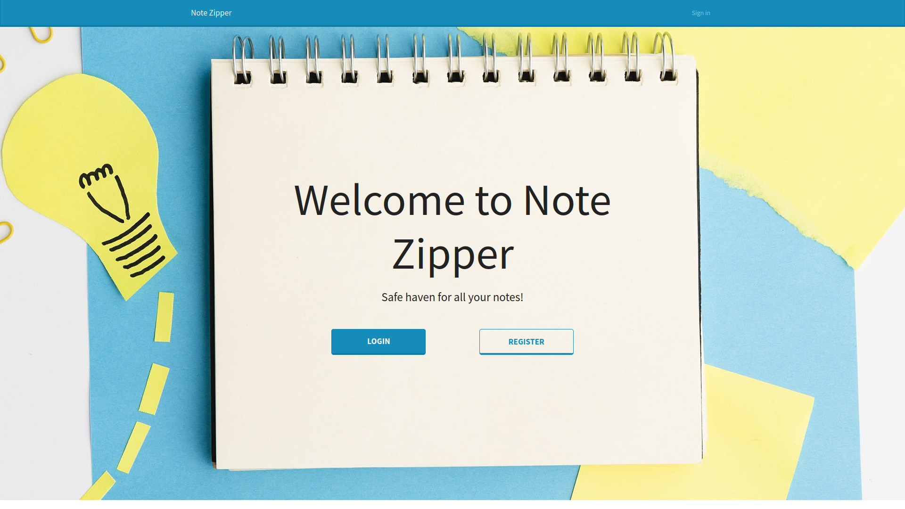
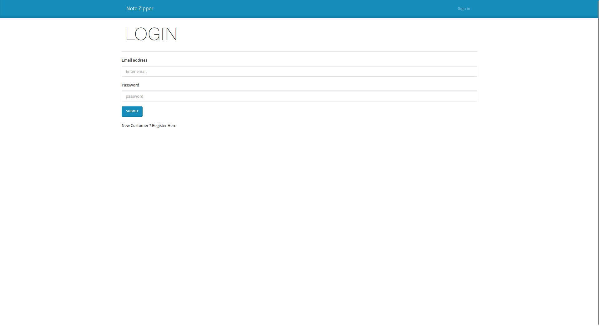
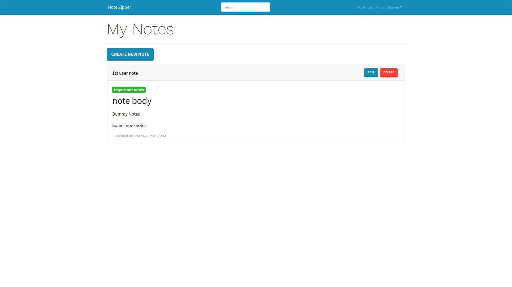
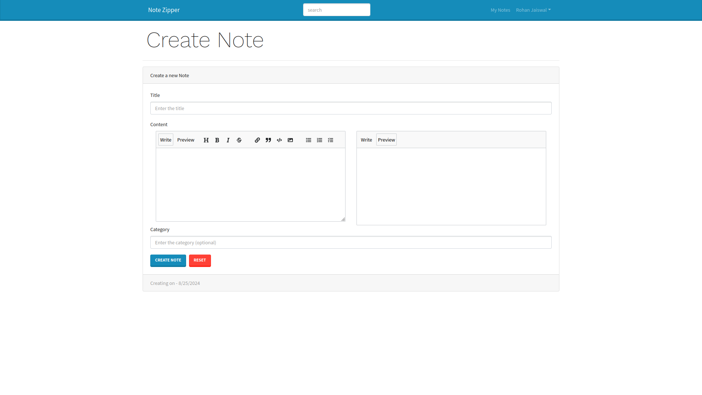
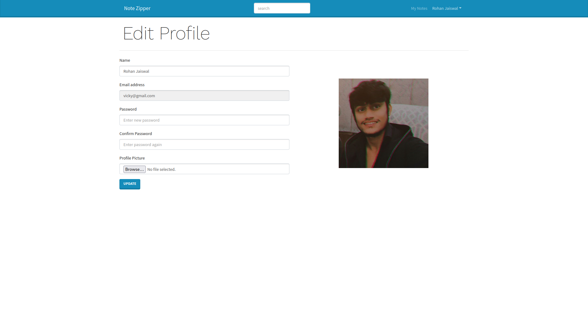

# Notes App - MERN Stack

This is a simple Notes application built using the MERN stack (MongoDB, Express.js, React, and Node.js) that allows users to create, read, update, and delete notes (all CRUD functionality).

## Getting Started

### Prerequisites

- Node.js and npm installed on your local machine.
- MongoDB installed and running.

### Installation & Setup

1. Clone the repository:

   ```bash
   git clone https://github.com/deadrohan19/Notes-App.git
   cd Notes-App
   ```

2. Install both backend & frontend dependencies

   ```bash
   npm install
   cd frontend && npm install
   ```

3. Create .env file in root folder and give corresponding details
   ```
   PORT =
   MONGO_URI =
   JWT_SECRET =
   NODE_ENV = development
   ```
4. Run backend & frontend in development
   ```bash
   npm run dev
   ```

## Technologies Used

- **MongoDB**: Database to store notes.
- **Express.js**: Backend framework for building RESTful APIs.
- **React**: Frontend library for building the user interface.
- **Node.js**: JavaScript runtime for the backend server.
- **Mongoose**: Object Data Modeling (ODM) library for MongoDB and Node.js.
- **Axios**: Promise-based HTTP client for the browser and Node.js, used to make API requests from the React frontend.
- **Bootstrap**: Frontend framework for responsive UI components.

## Features

- **Create a Note**: Add new notes with a title and content.
- **Read Notes**: View a list of all notes, with the ability to view details of each note.
- **Update a Note**: Edit the title and content of an existing note.
- **Delete a Note**: Remove notes from the list.
- **Responsive Design**: The application is mobile-friendly.
- **Authorization**: User can register and login to have persisting private data

## Screenshots






